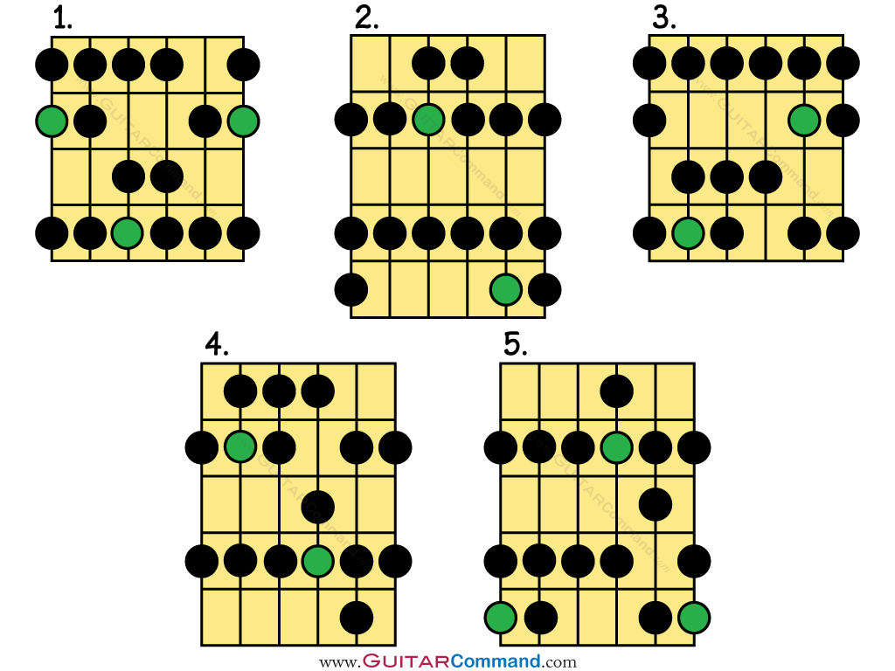

### General Beginner Exercises
-  Learn notes on the Low E and A strings.
- [My 7 Best Tips for a Self-Taught Guitarist | Tomo Fujita](https://www.youtube.com/watch?v=0AjGZKzt0ms&t=762s)
- [Finger Gym - Weak Fingers? Fix Them Here | Justin Guitar](https://www.youtube.com/watch?v=jFHF-U91jow&list=PLlwfspJqZ126hqrTeGvssFlJNuTk0a4-J&index=4)
- [Older learner? Here's how to learn faster! | Justin Guitar](https://www.youtube.com/watch?v=1xY1VS5-rqQ&list=PLlwfspJqZ126hqrTeGvssFlJNuTk0a4-J&index=1)
- [Want Fast & Perfect Chord Changes on Guitar? | Justin Guitar](https://www.youtube.com/watch?v=xSFHgeJUuIs&list=PLlwfspJqZ126hqrTeGvssFlJNuTk0a4-J&index=8)
- [Justin Guitar Beginner Exercise Playlist](https://www.youtube.com/playlist?list=PLlwfspJqZ126hqrTeGvssFlJNuTk0a4-J)

---

### Major Scale Positions


#### Exercises
> [!important] Play one octave of the A Major Scale

```
E ----------------------------------------------
B ----------------------------------------------
G ----------------------------------------------
D ----------------------4---6---7---------------
A ----------4---5---7---------------------------
E --5---7---------------------------------------
```

- Place thumb flat and squishy against the centre or below centre of the neck
- Spread fingers and place one finger per fret
- Avoid the palm or side of the hand touching the bottom of the neck
- Press string as light as possible while playing
- The goal is to have the hand as relaxed as possible


---

### Fingerstyle
- [Finger Style For Beginners. Start Here | Justin Guitar](https://www.youtube.com/watch?v=2WB8otOcz78&t=5s)
- [Beginner Fingerstyle Playlist | Justin Guitar](https://www.youtube.com/playlist?list=PLlwfspJqZ124AJI80XytatvV8NO7qY_VP)
- [Folk Fingerstyle Playlist | Justin Guitar]